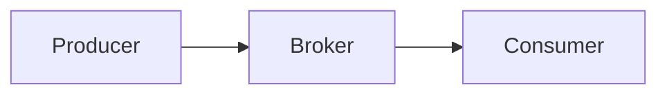
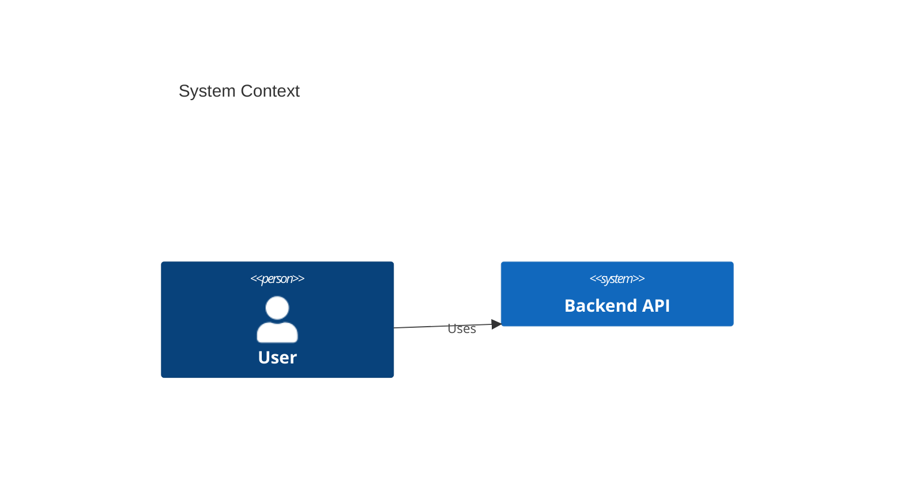

# Pattern Name

## Overview

Short description of the pattern.

---

## Problem

What problem does this pattern solve?

---

## Solution

Explain the solution.

---

## Architecture





!!! note ""

    Important engineering note.

!!! warning

    Be careful with this pattern.

!!! tip

    Useful engineering trick.

# Pattern Name

## Contexte

Dans les architectures modernes, ce problème apparaît lorsque :

- ...
- ...
- ...

Ce pattern est utilisé pour résoudre ce problème.

---

## Problème

Sans ce pattern :

- risque de ...
- difficulté à ...
- incohérence possible entre ...

---

## Solution

Le pattern consiste à :

1. ...
2. ...
3. ...

Principe clé :

> ...

---

## Architecture

```mermaid
flowchart LR

A[Component A] --> B[Component B]
B --> C[Component C]