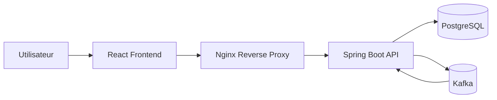
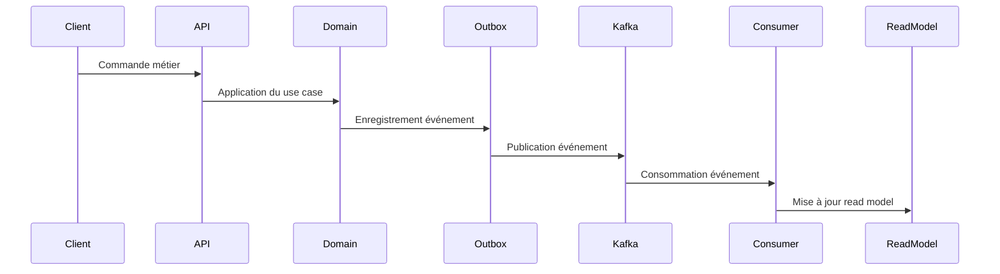
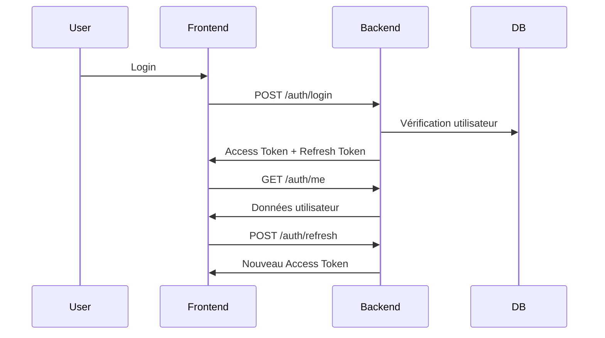
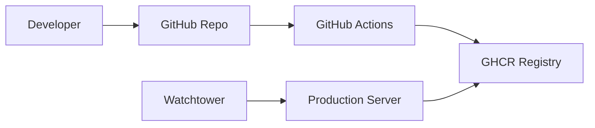

# Seaway — Architecture Diagrams

Ce document présente les principaux diagrammes d’architecture
du système Seaway.

Les diagrammes permettent de comprendre rapidement :

- la structure globale du système
- le flux des événements
- le fonctionnement de l'authentification
- le déploiement de l'application

---

# 1 — Architecture globale

Description :
- L'utilisateur accède à l'application via le frontend React.
- Nginx sert de reverse proxy et gère HTTPS.
- Le backend Spring Boot traite les requêtes.
- PostgreSQL stocke les données métier.
- Kafka transporte les événements du système.

# 2 — Flux Event-Driven

Description :
1. une commande est envoyée à l'API
2. le domaine applique la logique métier
3. un événement est généré
4. l'événement est enregistré dans l'outbox
5. l'événement est publié dans Kafka
6. les consumers mettent à jour les read models

# 3 — Flux d’authentification JWT

Description :

1. l'utilisateur se connecte
2. le backend génère un access token et un refresh token
3. les tokens sont stockés dans des cookies HttpOnly
4. le frontend utilise `/auth/me` pour récupérer l'utilisateur
5. si le token expire, un refresh est effectué automatiquement

# 4 — Architecture CI/CD

Description :
1. le développeur pousse le code sur GitHub
2. GitHub Actions exécute la CI
3. les images Docker sont construites
4. les images sont publiées dans GHCR
5. le serveur récupère les nouvelles images
6. Watchtower redéploie automatiquement les containers

# Résumé de l'architecture

Le système Seaway repose sur plusieurs principes clés :
- architecture hexagonale
- event-driven architecture
- CQRS léger
- API stateless avec JWT
- déploiement conteneurisé
- CI/CD automatisé

Cette architecture permet :
- une forte modularité
- une bonne résilience
- une évolution progressive du système
