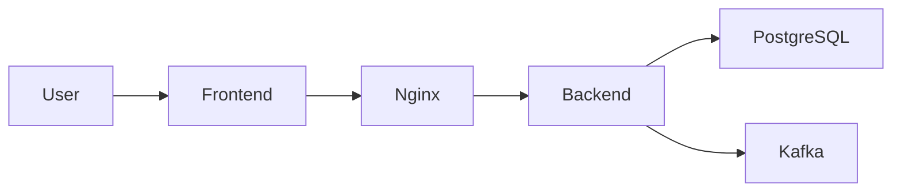

# Seaway — Security Overview

## Objectif

Mettre en place une architecture de sécurité
défensive par défaut pour l'application Seaway.

Les principes suivis :

- authentification stateless
- séparation frontend / backend
- exposition minimale des services
- défense en profondeur

---

# Authentification

Seaway utilise une authentification basée sur **JWT**.

Architecture :

- Access Token (durée de vie courte)
- Refresh Token (renouvellement de session)

Les tokens sont stockés dans :

- cookies **HttpOnly**
- cookies **Secure**

Flux d'authentification :

1. `POST /auth/login`
2. génération access token + refresh token
3. stockage dans cookies sécurisés
4. appels API authentifiés via cookies
5. `POST /auth/refresh` pour renouveler l'access token

---

# Autorisation

Le système utilise un modèle **RBAC (Role-Based Access Control)**.

Rôles actuels :

- `ADMIN`
- `USER`

L'autorisation est appliquée via :

- Spring Security
- contrôles d'accès au niveau des endpoints

---

# Backend Security

Spring Security est configuré en **mode stateless**.

Principes :

- sessions désactivées
- authentification via JWT
- filtres personnalisés pour validation du token

Protections :

- password hashing via **BCrypt**
- optimistic locking (`@Version`)
- validation des entrées

---

# Reverse Proxy

Nginx agit comme point d'entrée unique.

Responsabilités :

- terminaison HTTPS
- reverse proxy vers le backend
- protection contre certaines attaques

Headers de sécurité activés :

- `X-Frame-Options`
- `X-Content-Type-Options`
- `Strict-Transport-Security`
- `Referrer-Policy`
- `Permissions-Policy`

---

# Docker Security

Les conteneurs sont configurés selon le principe
du **moindre privilège**.

Mesures appliquées :

- exécution avec un utilisateur non-root
- filesystem en lecture seule
- `/tmp` monté en `tmpfs`

---

# Firewall

Le firewall UFW applique une politique restrictive.

Ports exposés :

- `22` — SSH
- `80` — ACME challenge (certificats)
- `443` — HTTPS

Ports internes non exposés :

- PostgreSQL
- Kafka

---

# Isolation réseau

Les services sensibles ne sont accessibles
que via le réseau Docker interne.

- PostgreSQL
- Kafka
- services internes

Aucun de ces services n'est exposé publiquement.

---

# Défense en profondeur

La sécurité repose sur plusieurs couches :

1. authentification JWT
2. autorisation RBAC
3. reverse proxy sécurisé
4. isolation réseau
5. conteneurs sécurisés
6. firewall restrictif

Cette approche limite l'impact
d'une compromission éventuelle.