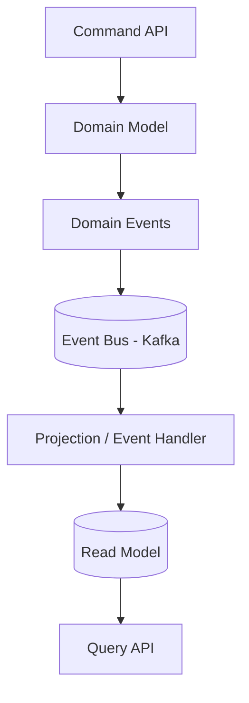

# CQRS Pattern (Command Query Responsibility Segregation)

## Contexte

Dans de nombreuses applications traditionnelles,
le même modèle de données est utilisé pour :

- écrire les données
- lire les données

Cette approche fonctionne pour des systèmes simples,
mais elle devient rapidement problématique lorsque
les besoins de lecture et d’écriture sont très différents.

Par exemple :

- les opérations d’écriture doivent respecter
  les règles métier et les invariants
- les opérations de lecture doivent être rapides
  et optimisées pour l’affichage

Utiliser un seul modèle pour ces deux besoins
peut rendre l’architecture difficile à maintenir.

Le pattern **CQRS (Command Query Responsibility Segregation)**
propose de séparer ces responsabilités.

---

# Principe

CQRS consiste à séparer :
```
Commands (écriture)
Queries (lecture)
```

Les commandes modifient l’état du système.

Les requêtes récupèrent des informations.

Ces deux types d’opérations peuvent utiliser
des modèles de données différents.

---

# Command Model

Le **command model** est responsable des modifications
de l’état métier.

Il applique les règles métier et garantit
les invariants du domaine.

Exemples de commandes :
``` java
CreateSejour
UpdateSejour
ScheduleService
CancelService
```

Le command model est généralement :

- plus riche
- centré sur le domaine
- orienté règles métier

---

# Query Model

Le **query model** est optimisé
pour la lecture des données.

Il peut contenir :

- des agrégations
- des projections
- des structures adaptées à l’interface utilisateur

Exemples :
``` java
SejourListView
SejourDetailView
DashboardView
```

Le query model ne contient
pas de logique métier complexe.

---

# Architecture simplifiée


Les événements permettent
de synchroniser le read model
avec le command model.

---

# Event-driven CQRS

Dans de nombreuses architectures modernes,
CQRS est combiné avec un système d’événements.

Flux typique :

1. une commande est exécutée
2. le domaine applique la modification
3. un événement est publié
4. les projections mettent à jour les read models

Cela permet :

- un découplage fort
- une évolution indépendante
- une bonne scalabilité

---
!!! tip "Avantages"  
  
    CQRS apporte plusieurs bénéfices :  
  
    - séparation claire des responsabilités  
    - optimisation indépendante lecture / écriture  
    - meilleure scalabilité  
    - meilleure adaptabilité aux besoins UI  
  
    Il est particulièrement adapté aux architectures event-driven.  
  
---  
  
!!! warning "Inconvénients"  
  
    CQRS introduit une complexité supplémentaire :  
  
    - duplication de données  
    - gestion de la cohérence  
    - architecture plus riche  
  
    Les systèmes CQRS sont généralement  
    **eventually consistent**.  
  
    Cela signifie que le read model peut être légèrement en retard par rapport au write model.

# Quand utiliser CQRS

CQRS est particulièrement utile lorsque :

- les lectures sont beaucoup plus fréquentes
- les besoins de lecture sont très différents
- le système utilise des événements
- l’architecture est distribuée

Pour les systèmes simples,
un modèle unique peut suffire.

---

# Conclusion

CQRS permet de séparer les responsabilités
de lecture et d’écriture.

Combiné avec des événements,
il devient un outil puissant
pour construire des architectures
modulaires et évolutives.
