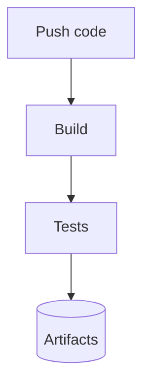
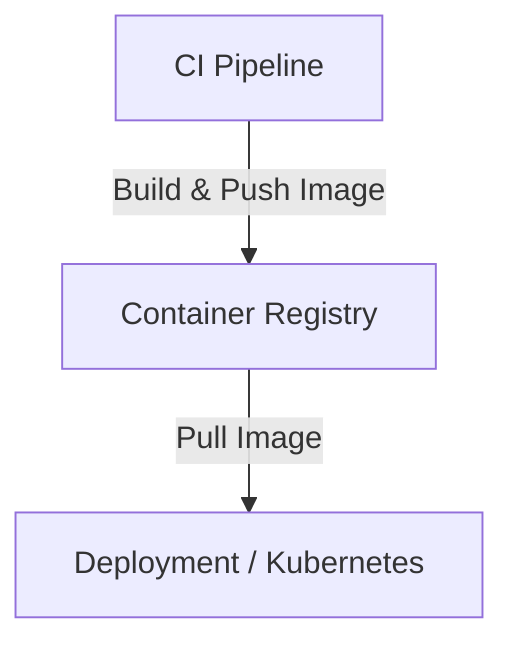
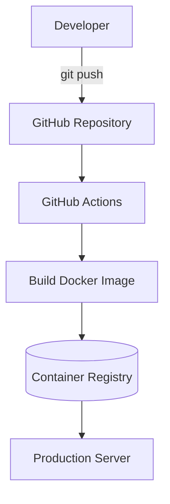

# CI/CD Pipeline Pattern

## Contexte

Les applications modernes doivent être livrées rapidement
tout en garantissant la qualité du code et la fiabilité
des déploiements.

Les pratiques **CI/CD (Continuous Integration / Continuous Deployment)**
permettent d’automatiser le cycle de livraison logiciel.

Une pipeline CI/CD automatise :

- la compilation
- les tests
- la construction des artefacts
- la publication
- le déploiement

L'objectif est de produire des versions
reproductibles et fiables de l'application.

---

# Continuous Integration (CI)

La **Continuous Integration** consiste à intégrer
fréquemment les modifications de code dans le repository.

Chaque modification déclenche une pipeline
qui vérifie que l'application reste fonctionnelle.

Étapes typiques :

La CI permet de détecter rapidement :

- erreurs de compilation
- régressions
- tests cassés

---

# Continuous Deployment (CD)

La **Continuous Deployment** automatise la mise
à disposition des nouvelles versions.

Flux simplifié :


Les nouvelles versions peuvent être
déployées automatiquement en production
ou validées manuellement.

---

# Pipeline typique

Une pipeline moderne inclut plusieurs étapes.

## 1 — Build

Compilation de l’application.

Exemple :

```bash
mvn package
npm build
```

---

## 2 — Tests

Exécution automatique :

- tests unitaires
- tests d’intégration
- tests API

Les tests garantissent
la qualité du code livré.

---

## 3 — Construction d’images

Dans les architectures conteneurisées,
la pipeline construit une image Docker.

Exemple :
```bash
docker build
```

---

## 4 — Publication

Les images sont publiées dans un
container registry.

Exemples :

- GitHub Container Registry (GHCR)
- Docker Hub
- AWS ECR
- GitLab Registry

Le registry devient la source
des artefacts déployables.

---

## 5 — Déploiement

Le système de production récupère
la nouvelle version.

Exemple :
```bash
docker compose pull
docker compose up -d
```

Ce mécanisme peut être automatisé
avec des outils de déploiement.

---

# Exemple avec GitHub Actions

Pipeline simplifiée :


GitHub Actions permet d’automatiser
les différentes étapes.

---

# Bonnes pratiques

Plusieurs pratiques sont recommandées.

## Pipeline rapide

Les pipelines doivent être rapides
pour encourager les déploiements fréquents.

---

## Tests automatisés

Les tests doivent être exécutés
avant toute publication.

---

## Artefacts immuables

Les artefacts (images Docker)
ne doivent pas être modifiés après publication.

---

## Environnements séparés

Il est recommandé d’utiliser
plusieurs environnements :
```bash
dev
test
production
```

---

!!! tip "Avantages"

    Les pipelines CI/CD apportent :

    - automatisation
    - reproductibilité
    - qualité du code
    - déploiements rapides

    Elles réduisent les erreurs humaines et accélèrent la livraison.

---

!!! warning "Limites"

    Les pipelines introduisent une complexité d’infrastructure.

    Elles nécessitent :

    - maintenance
    - surveillance
    - gestion des secrets

    Cependant ces contraintes sont largement compensées par les bénéfices.

---

# Conclusion

Les pipelines CI/CD sont devenues
un élément central du développement
logiciel moderne.

Elles permettent d’automatiser
la construction, les tests
et le déploiement des applications,
tout en améliorant la qualité
et la fiabilité des livraisons.
