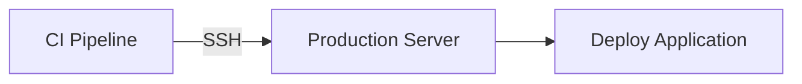
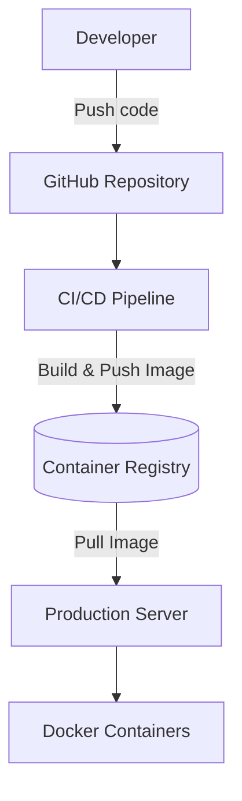

# Pull-Based Deployment Pattern

## Contexte

Dans de nombreuses chaînes CI/CD, le système d'intégration
continue déploie directement l'application sur les serveurs
de production.

Ce modèle est appelé **push-based deployment**.

Exemple :


Cependant, ce modèle présente plusieurs limites :

- ouverture du serveur aux connexions externes
- dépendance au réseau entrant
- surface d’attaque plus importante
- complexité dans les environnements NAT

Une alternative consiste à utiliser
le **pull-based deployment**.

---

# Principe

Dans un modèle pull-based, le serveur de production
ne reçoit aucune connexion depuis la CI.

Au contraire, il récupère lui-même
les nouvelles versions de l'application.

Architecture simplifiée :


Le serveur surveille les nouvelles images
et met à jour les services automatiquement.

---

# Étapes du pipeline

## 1 — Push du code

Le développeur pousse le code vers le repository.
```bash
git push
```

Cela déclenche la pipeline CI.

---

## 2 — Build des images

La CI :

- compile l’application
- construit les images Docker
- publie les images dans un registry

Exemple :
```bash
ghcr.io/my-org/backend:latest
```

---

## 3 — Publication dans le registry

Les images sont stockées dans un container registry :

- GHCR
- Docker Hub
- AWS ECR
- GitLab Registry

Le registry devient la **source de vérité
des artefacts déployables**.

---

## 4 — Mise à jour côté serveur

Le serveur de production récupère
les nouvelles images.

Exemple :
```bash
docker compose pull
docker compose up -d
```

Cela redémarre automatiquement
les services avec les nouvelles versions.

---

# Automatisation avec Watchtower

Un outil comme **Watchtower** peut automatiser
la mise à jour des conteneurs.

Fonctionnement :

1. Watchtower surveille les images Docker
2. détecte une nouvelle version
3. redémarre le container

Exemple de configuration :
```yml
com.centurylinklabs.watchtower.enable=true
```

---

!!! tip "Avantages"

    Le pull-based deployment apporte plusieurs bénéfices :

    - aucune connexion entrante nécessaire
    - meilleure sécurité
    - architecture plus simple
    - compatibilité avec les environnements NAT
    - déploiement automatisé

---

!!! warning "Limites"

    Cette approche introduit quelques contraintes :
    
    - moins de contrôle précis sur le moment exact du déploiement
    - gestion des versions d’images nécessaire
    - surveillance du registry

    Cependant ces limitations sont généralement acceptables.

---

# Bonnes pratiques

Pour un système fiable :

- utiliser des images versionnées
- conserver les images précédentes
- surveiller les logs de déploiement
- automatiser les healthchecks

---

# Conclusion

Le pull-based deployment est particulièrement
adapté aux architectures conteneurisées.

En combinant :

- CI pour construire les images
- container registry pour stocker les artefacts
- serveur qui récupère les images

il est possible de construire
une pipeline de déploiement simple,
sécurisée et robuste.
