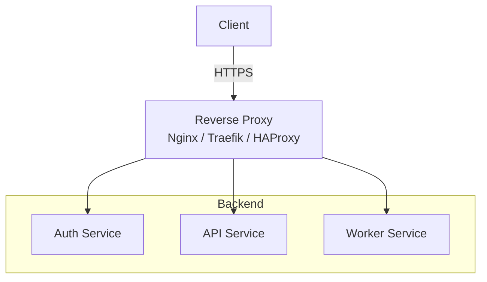
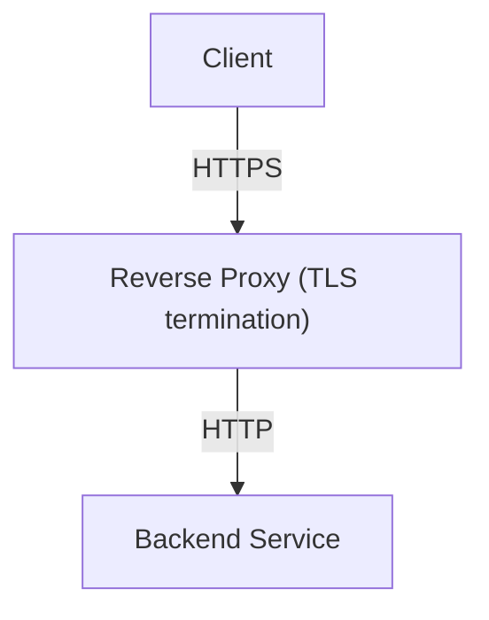

# Reverse Proxy Pattern

## Contexte

Dans une architecture web moderne, les applications backend
ne sont généralement pas exposées directement sur Internet.

Un composant intermédiaire est utilisé pour gérer
les requêtes entrantes : le **reverse proxy**.

Un reverse proxy est un serveur qui reçoit les requêtes
des clients et les transmet aux services internes.

Il agit comme un point d’entrée unique pour l’application.

---

# Principe

Architecture simplifiée :


Le reverse proxy reçoit les requêtes HTTP/HTTPS
et les redirige vers les services internes.

---

# Responsabilités principales

Un reverse proxy assure plusieurs fonctions importantes.

## Terminaison TLS

Le reverse proxy gère le chiffrement HTTPS.

Flux :


!!! tip "Avantages"

    - simplifie la configuration des services backend
    - centralise la gestion des certificats

---

## Routage des requêtes

Le reverse proxy peut diriger les requêtes
vers différents services.

Exemple :
```less
/api → backend API
/app → frontend SPA
/metrics → monitoring
```

Cela permet d’exposer plusieurs services
via un seul point d’entrée.

---

## Sécurité

Le reverse proxy peut appliquer
plusieurs mécanismes de sécurité :

- filtrage des requêtes
- limitation du débit (rate limiting)
- headers de sécurité
- blocage de certains endpoints

Exemples de headers :
```less
X-Frame-Options
X-Content-Type-Options
Referrer-Policy
Strict-Transport-Security
```

---

## Compression et performance

Le reverse proxy peut améliorer
les performances :

- compression gzip
- caching
- gestion des connexions

Cela réduit la charge
sur les services backend.

---

# Exemple avec Nginx

Configuration simplifiée :
```Dockerfile
server {
listen 443 ssl;

location /api {
    proxy_pass http://backend:8080;
}

location / {
    root /usr/share/nginx/html;
}

}
```

Dans cet exemple :

- `/api` est redirigé vers le backend
- le reste est servi par le frontend

---

!!! tip "Avantages"

    Le reverse proxy apporte plusieurs bénéfices :

    - point d’entrée unique
    - gestion centralisée de HTTPS
    - amélioration de la sécurité
    - meilleure observabilité
    - simplification de l’architecture

---

!!! warning "Limites"

    Le reverse proxy devient un composant critique du système.
    
    Il doit être :
    
    - correctement configuré
    - surveillé
    - sécurisé

    Dans les architectures très distribuées, un reverse proxy peut être complété par :

    - un load balancer
    - un API gateway

---

# Conclusion

Le reverse proxy est un élément
fondamental des architectures web modernes.

Il permet de centraliser :

- la gestion du trafic
- la sécurité
- le chiffrement HTTPS

et constitue souvent
la première couche d’infrastructure
exposée aux utilisateurs.
