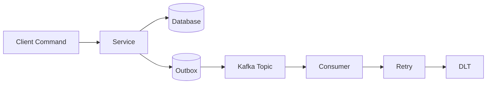
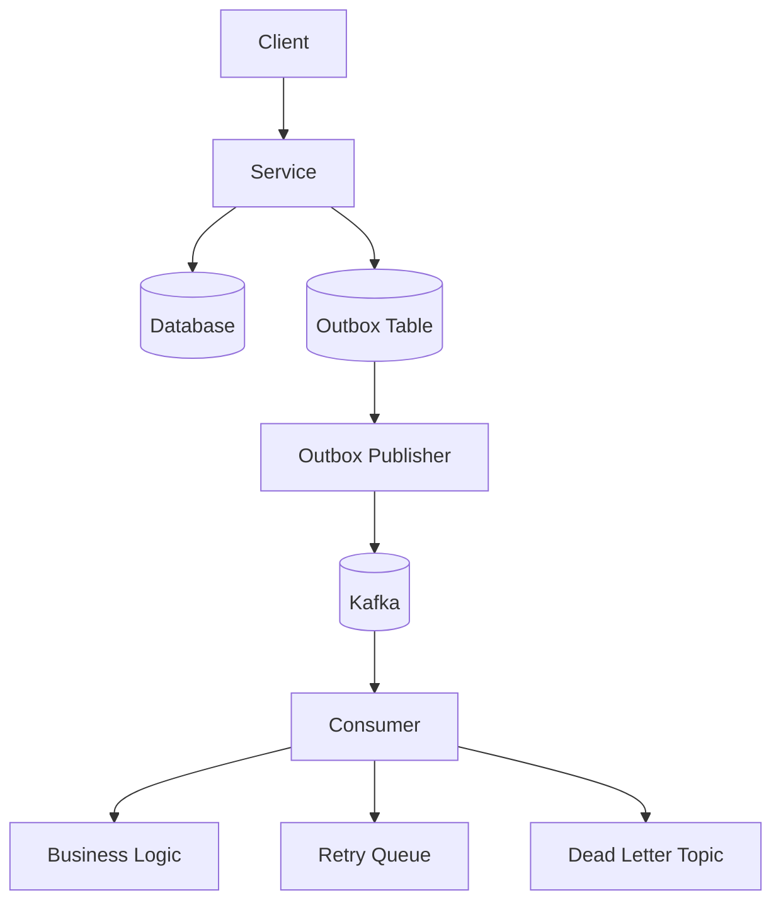

# Kafka Reliability Patterns
## Reliability Architecture


## Contexte

Les architectures basées sur Kafka reposent sur
la communication par événements entre services.

Cependant, dans un système distribué, plusieurs
problèmes peuvent survenir :

- pertes d’événements
- redélivrances de messages
- erreurs temporaires
- incohérences entre base de données et événements

Kafka garantit par défaut une livraison **at-least-once**,
ce qui signifie qu’un message peut être traité plusieurs fois.

Pour construire des systèmes fiables, plusieurs patterns
sont généralement combinés.

Les principaux sont :

- Outbox Pattern
- Retry
- Dead Letter Topic (DLT)
- Idempotent Consumers

Ensemble, ils permettent de construire
un pipeline événementiel robuste.

---

# Vue d’ensemble

Architecture simplifiée :

---

# 1 — Outbox Pattern

Le Outbox Pattern garantit la cohérence
entre la base de données et les événements.

Au lieu de publier directement dans Kafka,
le service enregistre l’événement dans une table
`outbox` dans la même transaction que la modification métier.

Un composant dédié publie ensuite l’événement vers Kafka.

!!! tip "Avantages"

    - élimine le problème du **dual write**
    - garantit que les événements ne sont pas perdus
    - permet de rejouer les événements

---

# 2 — Retry

Les erreurs temporaires sont fréquentes
dans les systèmes distribués :

- base de données temporairement indisponible
- dépendance externe lente
- congestion réseau

Le retry permet de réessayer le traitement
d’un message après un délai.

Exemple :
```bash
Retry 1 → 1 seconde
Retry 2 → 5 secondes
Retry 3 → 10 secondes
```
Le retry est généralement limité
pour éviter les boucles infinies.

---

# 3 — Dead Letter Topic (DLT)

Si un message échoue après tous les retries,
il est envoyé dans un **Dead Letter Topic**.

Convention :
```bash
<topic>.DLT
```

Exemple :
```bash
seaway.events
seaway.events.DLT
```

Les messages présents dans le DLT peuvent être :

- analysés
- corrigés
- rejoués

---

# 4 — Idempotent Consumers

Dans Kafka, un message peut être livré
plusieurs fois.

Un consumer doit donc être **idempotent**.

Cela signifie que traiter plusieurs fois
le même événement ne doit pas produire
d’effet de bord.

Stratégies possibles :

- stocker les `eventId` traités
- vérifier l’état métier
- utiliser la version des agrégats

---

# Combinaison des patterns

Ces patterns fonctionnent ensemble.

Flux complet :

1. une modification métier se produit
2. un événement est enregistré dans l’outbox
3. l’événement est publié dans Kafka
4. le consumer traite l’événement
5. en cas d’erreur → retry
6. si retry échoue → DLT
7. l’idempotence garantit l’absence de doublons

---

!!! tip "Avantages"

    Cette combinaison apporte :

    - résilience
    - cohérence
    - observabilité
    - tolérance aux erreurs

    Elle permet de construire des architectures event-driven robustes.

---

!!! warning "Limites"

    Ces patterns introduisent :

    - plus de composants
    - plus de complexité
    - plus d’observabilité nécessaire

    Cependant cette complexité est généralement nécessaire pour les systèmes distribués.

---

# Conclusion

Les systèmes event-driven doivent être conçus
pour gérer les défaillances.

Les patterns :

- Outbox
- Retry
- Dead Letter Topics
- Idempotent Consumers

forment un ensemble cohérent permettant
de construire des pipelines événementiels
fiables et résilients.
