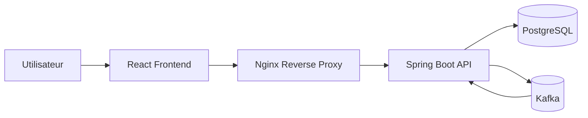
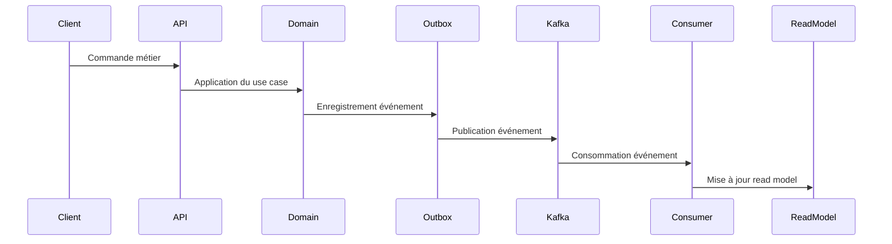

# Seaway — Architecture Diagrams

Ce document présente les principaux diagrammes d’architecture
du système Seaway.

Les diagrammes permettent de comprendre rapidement :

- la structure globale du système
- le flux des événements
- le fonctionnement de l'authentification
- le déploiement de l'application

---

# 1 — Architecture globale

Description :
- L'utilisateur accède à l'application via le frontend React.
- Nginx sert de reverse proxy et gère HTTPS.
- Le backend Spring Boot traite les requêtes.
- PostgreSQL stocke les données métier.
- Kafka transporte les événements du système.

# 2 — Flux Event-Driven

Description :
1- une commande est envoyée à l'API
2- le domaine applique la logique métier

un événement est généré

l'événement est enregistré dans l'outbox

l'événement est publié dans Kafka

les consumers mettent à jour les read models

# 3 — Flux d’authentification JWT
